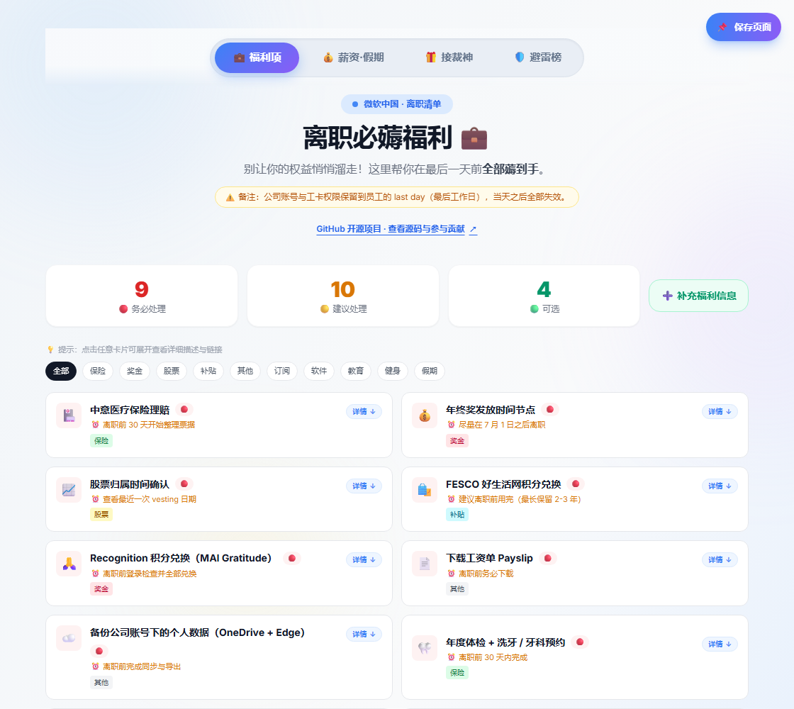
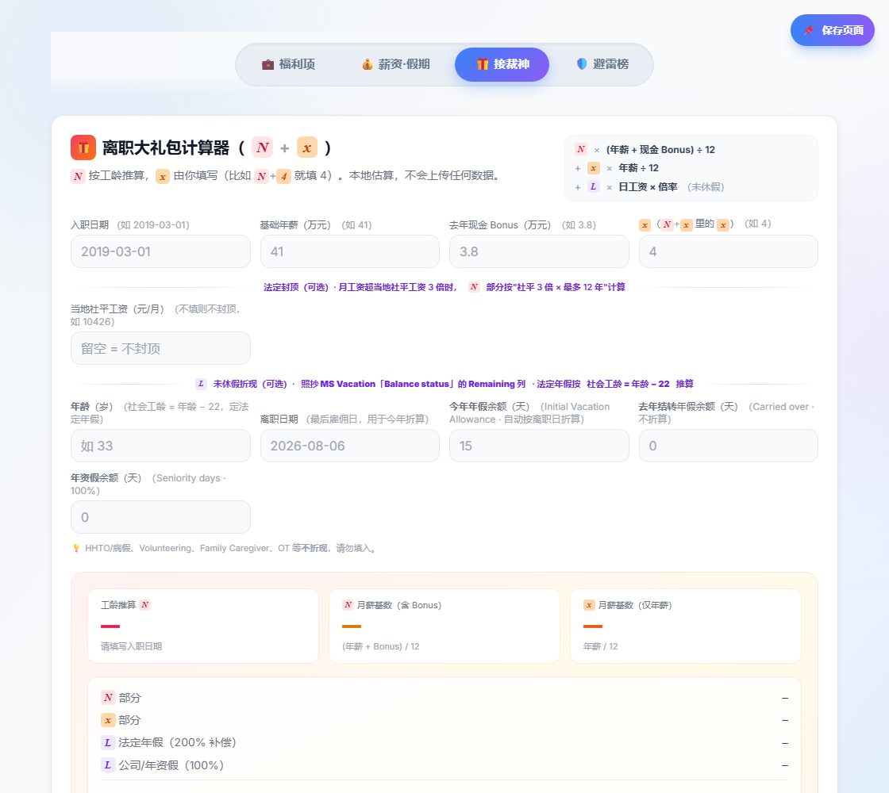

# 微软中国员工工具箱

面向微软中国员工及校友的非官方工具箱，汇集福利清单、发薪日、薪资参考和离职补偿计算。线上页面：[wzkiwi.com/benefits/ms](https://wzkiwi.com/benefits/ms/)。本项目与微软没有官方关联。

## 界面预览

截图取自[线上页面](https://wzkiwi.com/benefits/ms/)；发薪日期等实时信息会随时间变化。

### 福利清单



### 薪资与假期


### 补偿计算器



## 功能

- [LITE / PIP / GVSA / IBU 应对指南](https://wzkiwi.com/benefits/ms/?tab=guide)：分场景流程、协商项目、签字前清单与 HR 沟通模板
- 福利清单、优先级与类别筛选
- 发薪日、假期和股票区间参考
- 离职补偿与未休假折算计算器
- 匿名福利建议、薪资 midpoint 样本、老板避雷榜
- 页面统计和发薪日 Web Push 提醒

## 参与贡献

**只想补充或纠正信息？** [填写福利信息表单](https://github.com/pigWolfy/microsoft-china-employee-toolkit/issues/new?template=benefit.yml)，无需安装软件或写代码。[反馈页面问题](https://github.com/pigWolfy/microsoft-china-employee-toolkit/issues/new?template=bug.yml) 也可直接在线完成。GitHub Issue 是公开的，请勿提交个人信息或内部资料。

**想直接修改文件？** GitHub 网页可以编辑文件并发起 Pull Request；页面与接口改动也可在本地开发。操作步骤见 [贡献指南](CONTRIBUTING.md)。Pull Request 会自动运行构建检查，小型文字修改无需先在本地搭建环境。

## 本地运行

需要 Node.js 20.9+ 和 npm。全新克隆后，无需配置密钥或连接 TechFlow 主仓库，就能启动页面和公开接口：

```bash
git clone https://github.com/pigWolfy/microsoft-china-employee-toolkit.git
cd microsoft-china-employee-toolkit/server
npm ci
npm run dev
```

打开 `http://localhost:3000/`。福利清单、发薪日和本地计算器可直接使用；公开接口也能启动。仓库不包含线上投稿与薪资数据，所以本地薪资样本默认为空。编辑根目录的静态页面后，请重启开发服务以重新同步文件。

管理员功能、老板评分和推送提醒需要各自的环境变量。要开发这些功能，再参考 [服务端说明](server/README.md) 和 `server/.env.example` 创建自己的 `server/.env.local`。生产构建使用 `npm run build` 和 `npm start`。请勿把 `.env.local` 或 `server/data/` 提交到 Git。

## 仅托管静态页面

仓库根目录的 `index.html`、`sw.js`、`manifest.webmanifest` 和两个 SVG 图标可由任意静态服务器托管；例如在仓库根目录运行 `python -m http.server 8000`。此模式可使用清单、发薪日和本地计算器，但投稿、薪资样本、避雷榜、统计和推送提醒需要服务端。PWA 需要 HTTPS 或 localhost。首次加载的 Tailwind CSS、QRCode.js 和 Google Fonts 来自外部 CDN。

页面请求部署站点自身的 `/api/*`，不会向原站点发送用户提交的数据。`docs/screenshots/` 仅供 README 预览。原项目中的 `home.html` 和 nginx 配置不被此页面引用，因此不在运行包中。

## 目录

| 路径 | 用途 |
|---|---|
| `index.html`、`sw.js`、`manifest.webmanifest`、`icon*.svg` | 静态页面与 PWA |
| `server/src/app/api/` | 页面使用的五组 Next.js 接口 |
| `server/scripts/send-payday.mjs` | 每日运行的推送任务 |
| `server/data/` | 本地 JSONL 数据，已忽略，不随源码发布 |
| `docs/screenshots/` | README 界面预览图，不参与运行 |

页面从 TechFlow 主仓库的 `deploy/benefits-standalone/` 导出。主仓库的 `scripts/export-benefits-open-source.py` 用于同步静态文件；服务端可独立运行，不连接原站点的数据目录。

## 说明与许可证

本内容由社区整理，仅供参考。福利、劳动规则和许可条款可能因地区、雇佣合同与时间而变化，请以正式政策和个人协议为准。Microsoft 及相关标志归其权利人所有。

原创源代码按 [MIT License](LICENSE) 发布；外部链接、第三方服务和商标不包含在授权范围内。